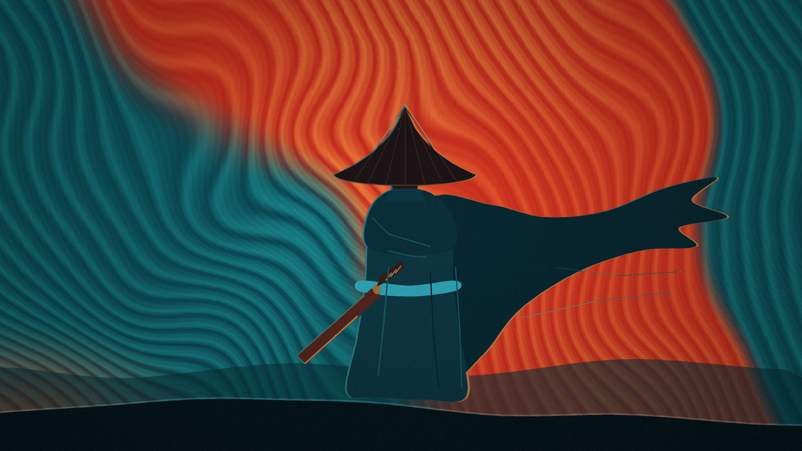

# ronin light for Omarchy

A light [Omarchy](https://omarchy.org/) theme built from the same wallpaper:
cold teal water, and a single hot ember orange-red for the lantern and the
ronin's glasses. Sand paper surfaces, deep teal ink, and restrained ember
accents create a bright, quiet workspace.



## Highlights

- Native Omarchy light mode through `mode = "light"`
- Sand paper terminal and editor surfaces with deep teal ink
- Matching generated colors for terminals, editors, browsers, Hyprland, and the
  Omarchy shell
- Ember focus states and cool syntax colors
- Same cold teal ronin wallpaper as the dark theme
- Matching Yaru red icons

## Install

Install directly from the public Git repository:

```bash
omarchy theme install https://github.com/sendorf/omarchy-ronin-light-theme
```

Or paste the repository URL into **Install > Style > Theme** from the Omarchy
menu, then select it.

You can also copy this directory into `~/.config/omarchy/themes/ronin-light` and
run:

```bash
omarchy theme set ronin-light
```

The dark counterpart lives at
[omarchy-ronin-theme](https://github.com/sendorf/omarchy-ronin-theme).

## Terminal transparency

Omarchy intentionally discards terminal configuration files from remotely
installed themes and safely regenerates them from `colors.toml`, so downloaded
copies use your normal terminal-opacity setting.

## Palette

The palette is the dark theme's, inverted. The warm sand foreground becomes the
paper background (`#F7F1E3`), the deep teal surfaces become ink (`#0F3D46`),
and the ember accent deepens to `#C4321F` so it still holds contrast on paper.

| Role | Color |
| --- | --- |
| Background | `#F7F1E3` |
| Foreground | `#0F3D46` |
| Accent | `#C4321F` |
| Selection | `#F6DED1` |
| Muted | `#6A8B90` |
| Cyan | `#10646C` |

Backgrounds run `#EFE8D8` → `#DDD4BD`, all a step darker than `background`, so
sunken chrome reads as sunken on paper.

`dark_foreground` and `muted` sit around 3:1 against `background`, every ANSI
normal clears 4:1, and the main text is above 10:1.

## What's in it

- `colors.toml` — the palette, in Omarchy's semantic format
- `backgrounds/1-ronin.png` — the wallpaper, unmodified. `omarchy theme bg next`
  cycles it.
- `icons.theme` — `Yaru-red`
- `preview.png` — the wallpaper, shown in the theme switcher
- `LICENSE`

Every app config (Alacritty, Foot, Kitty, Ghostty, Neovim, Helix, VS Code,
Chromium, btop, Obsidian, tmux, and the rest) is generated from `colors.toml` by
Omarchy at theme-apply time, so none of those files are shipped here.

## Wallpaper

The wallpaper is AI-generated and carries no third-party rights. It is
distributed under this repository's MIT License along with the rest of the
theme.

## Disclaimer

This is an unofficial fan-made desktop theme, not affiliated with or endorsed
by Omarchy or Basecamp.

See [LICENSE](LICENSE) for licensing details.
